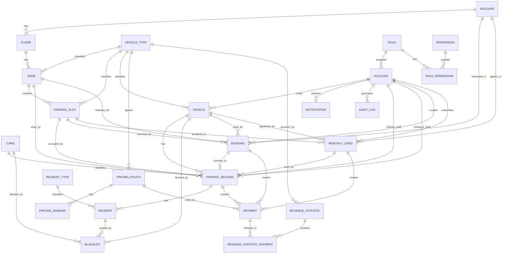

# 8. Concept, Entity & Physical Model

## 8.1 Modeling Scope

Phần này đồng bộ SRS với concept relationship, entity list và physical table model. Mục tiêu là để nghiệp vụ, ERD và thiết kế database không bị tách rời.

Các quyết định đã chốt trong SRS được phản ánh trong model:

- Booking phải chọn `Building` trước.
- Xe máy booking có thể chọn `Zone`; nếu không chọn, hệ thống tự chọn Zone phù hợp.
- Ô tô booking có thể chọn `Slot` hoặc `Zone`; nếu không chọn, hệ thống tự chọn Zone/Slot phù hợp.
- Ô tô vãng lai khi check-in chỉ được gợi ý `Zone`, không bắt buộc `Slot`.
- Ô tô booking và ô tô thẻ tháng phải có Slot được xác định trước khi giữ chỗ/áp dụng quyền lợi slot.
- Deposit Fee bằng giá của block đầu tiên theo bảng giá hiện hành.
- Booking no-show dùng mốc 45 phút.
- Mỗi monthly card chỉ áp dụng cho một xe, không dùng `max_registered_plate`.
- Monthly card có trạng thái `PENDING` khi chờ thanh toán/kích hoạt.
- Các biến pricing, timeout, grace period, penalty và rounding được cấu hình động ở tầng nghiệp vụ/application/admin configuration, không hard-code và không tạo thêm table riêng trong physical model hiện tại.

## 8.2 Entity Summary

| Entity/Table | Purpose |
|---|---|
| `role` | lưu vai trò của account. |
| `permission` | lưu quyền chức năng trong hệ thống. |
| `role_permission` | bảng trung gian cho quan hệ N-N giữa role và permission. |
| `account` | lưu tài khoản người dùng. Parking Staff được mô hình hóa bằng Account có Role phù hợp. |
| `building` | lưu tòa nhà gửi xe. |
| `floor` | lưu tầng thuộc tòa nhà. |
| `vehicle_type` | lưu loại phương tiện. |
| `zone` | lưu khu vực đỗ xe trong tầng. |
| `parking_slot` | lưu vị trí đỗ cụ thể, đặc biệt quan trọng với ô tô booking và ô tô thẻ tháng. |
| `vehicle` | lưu xe thuộc account. |
| `card` | lưu mã thẻ/mã gửi xe mô phỏng. |
| `parking_session` | lưu lượt gửi xe từ check-in đến check-out. |
| `incident_type` | lưu loại sự cố. |
| `incident` | lưu sự cố phát sinh trong session. |
| `blacklist` | lưu bản ghi chặn vehicle, card hoặc incident. |
| `booking` | lưu đặt chỗ trước. |
| `monthly_card` | lưu vé tháng/gói gửi xe định kỳ. |
| `pricing_policy` | lưu chính sách giá theo loại xe. |
| `pricing_window` | lưu rule tính giá theo khung giờ. |
| `payment` | lưu giao dịch thanh toán từ parking session, booking hoặc monthly card. |
| `revenue_statistic` | lưu dữ liệu thống kê doanh thu. |
| `revenue_statistic_payment` | bảng nối để truy vết payment được aggregate vào revenue statistic. |
| `notification` | lưu thông báo gửi đến account. |
| `audit_log` | lưu log thao tác để truy vết. |

#### 8.3 Physical Model Normalized

> Mục tiêu: chỉnh sửa physical/logical model để AI CLI đọc được, bám theo relationship của `PBMS_Conceptual_Model.md`, đồng thời chuẩn hóa attribute/datatype từ các physical ERD đã cung cấp.

---

### 8.3.1 Modeling Rules

#### 8.3.1.1 Database-Agnostic Rule

File này không viết theo một database cụ thể.

Không dùng datatype đặc thù như:

- `nvarchar`
- `ntext`
- `bit`
- `boolean`
- `serial`
- `identity`

Các datatype trong tài liệu là kiểu trung lập để AI/Developer có thể map sang database cụ thể sau.

| Neutral Type | PostgreSQL Mapping | SQL Server Mapping | MySQL Mapping |
|---|---|---|---|
| `varchar(100)` | `varchar(100)` | `nvarchar(100)` nếu cần Unicode ở bước triển khai SQL Server | `varchar(100)` với charset UTF-8 |
| `int` | `integer` | `int` | `int` |
| `timestamp` | `timestamp` | `datetime2` | `datetime` |
| `decimal(18,2)` | `numeric(18,2)` | `decimal(18,2)` | `decimal(18,2)` |

---

#### 8.3.1.2 Naming Convention

| Item | Convention |
|---|---|
| Table name | `snake_case` |
| Column name | `snake_case` |
| Primary key | `<table_name>_id` hoặc tên ngắn đã rõ nghĩa |
| Foreign key | `<referenced_table>_id` |
| Status column | `varchar(20)` |
| Code column | `varchar(20)` hoặc `varchar(50)` |
| Name column | `varchar(50)` hoặc `varchar(100)` |
| Description / reason / message | `varchar(100)` |

---

#### 8.3.1.3 Allowed Data Types

| Data Type | Usage |
|---|---|
| `int` | ID, FK, number, count, flag 0/1 |
| `varchar(20)` | status, enum ngắn, short code, license plate, phone |
| `varchar(50)` | name ngắn, username, email ngắn, method, action |
| `varchar(100)` | description, reason, message, address, password hash, long name |
| `decimal(18,2)` | toàn bộ tiền, phí, doanh thu, số đo nếu cần |
| `date` | ngày |
| `time` | giờ trong ngày |
| `timestamp` | thời điểm đầy đủ ngày + giờ |

Quy ước chuẩn hóa:

- Tất cả số tiền dùng `decimal(18,2)`.
- Không tồn tại nhiều kiểu decimal khác nhau.
- Field `boolean`, `bit` trong ảnh được chuẩn hóa thành `int` với ý nghĩa `0/1`.
- Unicode được xử lý bằng database encoding, ví dụ UTF-8.

---

#### 8.3.1.4 Generic Constraints

| Constraint | Meaning |
|---|---|
| `PK` | Primary Key |
| `FK -> table.column` | Foreign Key |
| `NOT NULL` | Bắt buộc có dữ liệu |
| `NULL` | Cho phép rỗng |
| `UNIQUE` | Không được trùng |
| `AUTO GENERATED` | ID tự sinh / auto increase |
| `CHECK` | Ràng buộc nghiệp vụ logic |
| `DEFAULT` | Giá trị mặc định logic |

---

### 8.3.2 Relationship Summary From Conceptual Model

| ID | Relationship | Cardinality | Physical Direction |
|---|---|---|---|
| R-STR-001 | Parking Building has Floor | 1 - N | `floor.building_id -> building.building_id` |
| R-STR-002 | Floor has Zone | 1 - N | `zone.floor_id -> floor.floor_id` |
| R-STR-003 | Zone contains Parking Slot | 1 - 0..N | `parking_slot.zone_id -> zone.zone_id` |
| R-STR-004 | Vehicle Type classifies Parking Slot | 1 - 0..N | `parking_slot.vehicle_type_id -> vehicle_type.vehicle_type_id` |
| R-STR-005 | Vehicle Type classifies Vehicle | 1 - 0..N | `vehicle.vehicle_type_id -> vehicle_type.vehicle_type_id` |
| R-AUTH-001 | Role grants Permission | N - M | `role_permission(role_id, permission_id)` |
| R-AUTH-002 | Account assigned Role | N - 1 | `account.role_id -> role.role_id` |
| R-AUTH-003 | Account owns Vehicle | 1 - 0..N | `vehicle.account_id -> account.account_id` |
| R-AUTH-004 | Account receives Notification | 1 - 0..N | `notification.account_id -> account.account_id` |
| R-AUTH-005 | Account generates Audit Log | 1 - 0..N | `audit_log.account_id -> account.account_id` |
| R-OPS-001 | Vehicle has Parking Session | 1 - N | `parking_session.vehicle_id -> vehicle.vehicle_id` |
| R-OPS-002 | Card identifies Parking Session | 1 - N | `parking_session.card_id -> card.card_id` |
| R-OPS-003 | Parking Session occupies Parking Slot | N - 1 | `parking_session.slot_id -> parking_slot.slot_id` |
| R-OPS-004 | Parking Staff handles Parking Session | 0..N - N | `parking_session.in_staff_id/out_staff_id -> account.account_id` |
| R-OPS-005 | Parking Session has Incident | 1 - 0..N | `incident.session_id -> parking_session.session_id` |
| R-OPS-006 | Blacklist blocks Vehicle | 1 - 0..N | `blacklist.vehicle_id -> vehicle.vehicle_id` |
| R-OPS-007 | Blacklist blocks Card | 1 - 0..N | `blacklist.card_id -> card.card_id` |
| R-OPS-008 | Blacklist blocks Incident | 1 - 0..N | `blacklist.incident_id -> incident.incident_id` |
| R-BOOK-001 | Account has Booking | 1 - 0..N | `booking.account_id -> account.account_id` |
| R-BOOK-002 | Vehicle is used by Booking | 1 - 0..N | `booking.vehicle_id -> vehicle.vehicle_id` |
| R-BOOK-003 | Booking is requested in Building | Building 1 - 0..N Booking | `booking.building_id -> building.building_id` |
| R-BOOK-004 | Booking may select or be assigned Zone | Zone 1 - 0..N Booking | `booking.zone_id -> zone.zone_id` |
| R-BOOK-005 | Booking may reserve Parking Slot | Parking Slot 1 - 0..N Booking | `booking.slot_id -> parking_slot.slot_id` |
| R-BOOK-006 | Booking creates Payment | 1 - 0..N | `payment.booking_id -> booking.booking_id` |
| R-BOOK-007 | Booking converts to Parking Session | 0..1 - 1 | `parking_session.booking_id -> booking.booking_id` |
| R-MONTH-001 | Account subscribes Monthly Card | 1 - 0..N | `monthly_card.account_id -> account.account_id` |
| R-MONTH-002 | Vehicle registered in Monthly Card | 1 - 0..N | `monthly_card.vehicle_id -> vehicle.vehicle_id` |
| R-MONTH-003 | Monthly Card includes Parking Slot | Parking Slot 1 - 0..N Monthly Card | `monthly_card.assigned_slot_id -> parking_slot.slot_id` |
| R-MONTH-004 | Monthly Card creates Payment | 1 - 0..N | `payment.monthly_card_id -> monthly_card.monthly_card_id` |
| R-MONTH-005 | Monthly Card has Parking Session | 1 - 0..N | `parking_session.monthly_card_id -> monthly_card.monthly_card_id` |
| R-PAY-001 | Parking Session creates Payment | 1 - 0..N | `payment.session_id -> parking_session.session_id` |
| R-PAY-003 | Revenue Statistic aggregates Payment | 1 - N | `revenue_statistic_payment(statistic_id, payment_id)` |
| R-PRICE-001 | Vehicle Type applies Pricing Policy | 1 - 0..N | `pricing_policy.vehicle_type_id -> vehicle_type.vehicle_type_id` |
| R-PRICE-002 | Pricing Policy applies Payment | 1 - N | `payment.pricing_policy_id -> pricing_policy.pricing_policy_id` |
| R-PRICE-003 | Pricing Policy has Pricing Window | 1 - 1..N | `pricing_window.pricing_policy_id -> pricing_policy.pricing_policy_id` |

---

### 8.3.3 Physical Tables

#### 3.1 `role`

Purpose: lưu vai trò của account.

| Column | Type | Constraints | Meaning |
|---|---|---|---|
| role_id | int | PK, AUTO GENERATED, NOT NULL | ID vai trò |
| role_name | varchar(50) | NOT NULL, UNIQUE | Tên vai trò |
| description | varchar(100) | NULL | Mô tả vai trò |

---

#### 3.2 `permission`

Purpose: lưu quyền chức năng trong hệ thống.

| Column | Type | Constraints | Meaning |
|---|---|---|---|
| permission_id | int | PK, AUTO GENERATED, NOT NULL | ID quyền |
| permission_code | varchar(50) | NOT NULL, UNIQUE | Mã quyền |
| permission_name | varchar(50) | NOT NULL | Tên quyền |
| description | varchar(100) | NULL | Mô tả quyền |
| permission_status | varchar(20) | NOT NULL | Trạng thái quyền |

---

#### 3.3 `role_permission`

Purpose: bảng trung gian cho quan hệ N-N giữa role và permission.

| Column | Type | Constraints | Meaning |
|---|---|---|---|
| role_id | int | PK, FK -> role.role_id, NOT NULL | Vai trò |
| permission_id | int | PK, FK -> permission.permission_id, NOT NULL | Quyền |

---

#### 3.4 `account`

Purpose: lưu tài khoản người dùng. Parking Staff được mô hình hóa bằng Account có Role phù hợp.

| Column | Type | Constraints | Meaning |
|---|---|---|---|
| account_id | int | PK, AUTO GENERATED, NOT NULL | ID tài khoản |
| role_id | int | FK -> role.role_id, NOT NULL | Vai trò chính của tài khoản |
| username | varchar(50) | NOT NULL, UNIQUE | Tên đăng nhập |
| password_hash | varchar(100) | NOT NULL | Mật khẩu đã hash |
| full_name | varchar(100) | NULL | Họ tên |
| email | varchar(100) | NULL, UNIQUE | Email |
| phone | varchar(20) | NULL | Số điện thoại |
| account_status | varchar(20) | NOT NULL | Trạng thái tài khoản |
| created_at | timestamp | NOT NULL | Thời điểm tạo |

---

#### 3.5 `building`

Purpose: lưu tòa nhà gửi xe.

| Column | Type | Constraints | Meaning |
|---|---|---|---|
| building_id | int | PK, AUTO GENERATED, NOT NULL | ID tòa nhà |
| building_code | varchar(20) | NOT NULL, UNIQUE | Mã tòa nhà |
| building_name | varchar(50) | NOT NULL | Tên tòa nhà |
| address | varchar(100) | NULL | Địa chỉ |
| total_floor | int | NOT NULL | Tổng số tầng |
| building_status | varchar(20) | NOT NULL | Trạng thái tòa nhà |
| created_at | timestamp | NOT NULL | Thời điểm tạo |

---

#### 3.6 `floor`

Purpose: lưu tầng thuộc tòa nhà.

| Column | Type | Constraints | Meaning |
|---|---|---|---|
| floor_id | int | PK, AUTO GENERATED, NOT NULL | ID tầng |
| building_id | int | FK -> building.building_id, NOT NULL | Tòa nhà chứa tầng |
| floor_number | int | NOT NULL | Số tầng |
| floor_name | varchar(50) | NULL | Tên tầng |
| floor_status | varchar(20) | NOT NULL | Trạng thái tầng |

Generic constraints:

- `UNIQUE(building_id, floor_number)`

---

#### 3.7 `vehicle_type`

Purpose: lưu loại phương tiện.

| Column | Type | Constraints | Meaning |
|---|---|---|---|
| vehicle_type_id | int | PK, AUTO GENERATED, NOT NULL | ID loại xe |
| type_name | varchar(50) | NOT NULL, UNIQUE | Tên loại xe |
| description | varchar(100) | NULL | Mô tả |
| vehicle_type_status | varchar(20) | NOT NULL | Trạng thái loại xe |

---

#### 3.8 `zone`

Purpose: lưu khu vực đỗ xe trong tầng.

| Column | Type | Constraints | Meaning |
|---|---|---|---|
| zone_id | int | PK, AUTO GENERATED, NOT NULL | ID zone |
| floor_id | int | FK -> floor.floor_id, NOT NULL | Tầng chứa zone |
| vehicle_type_id | int | FK -> vehicle_type.vehicle_type_id, NOT NULL | Loại xe được phục vụ |
| zone_code | varchar(20) | NOT NULL | Mã zone |
| zone_name | varchar(50) | NOT NULL | Tên zone |
| capacity | int | NOT NULL | Sức chứa zone |
| zone_status | varchar(20) | NOT NULL | Trạng thái zone |

Generic constraints:

- `UNIQUE(floor_id, zone_code)`
- `CHECK(capacity >= 0)`

---

#### 3.9 `parking_slot`

Purpose: lưu vị trí đỗ cụ thể, đặc biệt quan trọng với ô tô booking và ô tô thẻ tháng.

| Column | Type | Constraints | Meaning |
|---|---|---|---|
| slot_id | int | PK, AUTO GENERATED, NOT NULL | ID slot |
| zone_id | int | FK -> zone.zone_id, NOT NULL | Zone chứa slot |
| vehicle_type_id | int | FK -> vehicle_type.vehicle_type_id, NOT NULL | Loại xe phù hợp |
| slot_code | varchar(20) | NOT NULL, UNIQUE | Mã slot |
| slot_name | varchar(50) | NULL | Tên hiển thị |
| slot_status | varchar(20) | NOT NULL | AVAILABLE, RESERVED, OCCUPIED, BLOCKED |
| created_at | timestamp | NOT NULL | Thời điểm tạo |

Generic constraints:

- Một slot không được có nhiều active parking session cùng lúc.
- Ô tô booking và ô tô thẻ tháng có thể yêu cầu `slot_id`.

---

#### 3.10 `vehicle`

Purpose: lưu xe thuộc account.

| Column | Type | Constraints | Meaning |
|---|---|---|---|
| vehicle_id | int | PK, AUTO GENERATED, NOT NULL | ID xe |
| account_id | int | FK -> account.account_id, NULL | Chủ xe; nullable vì có thể nhập xe trước hoặc khách vãng lai |
| vehicle_type_id | int | FK -> vehicle_type.vehicle_type_id, NOT NULL | Loại xe |
| license_plate | varchar(20) | NOT NULL, UNIQUE | Biển số xe |
| registered_day | date | NULL | Ngày đăng ký xe trong hệ thống |
| vehicle_status | varchar(20) | NOT NULL | Trạng thái xe |

---

#### 3.11 `card`

Purpose: lưu mã thẻ/mã gửi xe mô phỏng.

| Column | Type | Constraints | Meaning |
|---|---|---|---|
| card_id | int | PK, AUTO GENERATED, NOT NULL | ID card |
| card_code | varchar(20) | NOT NULL, UNIQUE | Mã card nội bộ |
| rfid_code | varchar(50) | NULL, UNIQUE | Mã RFID mô phỏng nếu có |
| card_type | varchar(20) | NOT NULL | Loại card |
| card_status | varchar(20) | NOT NULL | AVAILABLE, ACTIVE, LOST, BLOCKED |

---

#### 3.12 `parking_session`

Purpose: lưu lượt gửi xe từ check-in đến check-out.

| Column | Type | Constraints | Meaning |
|---|---|---|---|
| session_id | int | PK, AUTO GENERATED, NOT NULL | ID session |
| vehicle_id | int | FK -> vehicle.vehicle_id, NOT NULL | Xe gửi |
| card_id | int | FK -> card.card_id, NULL | Card/mã gửi xe |
| zone_id | int | FK -> zone.zone_id, NULL | Zone được gợi ý hoặc sử dụng |
| slot_id | int | FK -> parking_slot.slot_id, NULL | Slot được dùng nếu có |
| booking_id | int | FK -> booking.booking_id, NULL, UNIQUE | Booking chuyển thành session |
| monthly_card_id | int | FK -> monthly_card.monthly_card_id, NULL | Thẻ tháng liên quan nếu có |
| in_staff_id | int | FK -> account.account_id, NULL | Staff xử lý check-in |
| out_staff_id | int | FK -> account.account_id, NULL | Staff xử lý check-out |
| check_in_time | timestamp | NOT NULL | Thời điểm vào |
| check_out_time | timestamp | NULL | Thời điểm ra |
| license_plate_in | varchar(20) | NOT NULL | Biển số lúc vào |
| license_plate_out | varchar(20) | NULL | Biển số lúc ra |
| session_status | varchar(20) | NOT NULL | ACTIVE, COMPLETED, LOST, EXPIRED, DOWNGRADED |

Generic constraints:

- Một `vehicle_id` chỉ được có tối đa một session `ACTIVE` cùng lúc.
- Một `slot_id` chỉ được có tối đa một session `ACTIVE` cùng lúc.
- `booking_id` unique vì một booking chỉ được chuyển thành tối đa một session.
- Xe máy có thể `slot_id = NULL` và dùng `zone_id`.
- Ô tô booking hoặc ô tô thẻ tháng nên có `slot_id`.

---

#### 3.13 `incident_type`

Purpose: lưu loại sự cố.

| Column | Type | Constraints | Meaning |
|---|---|---|---|
| incident_type_id | int | PK, AUTO GENERATED, NOT NULL | ID loại sự cố |
| incident_code | varchar(20) | NOT NULL, UNIQUE | Mã loại sự cố |
| incident_name | varchar(50) | NOT NULL | Tên loại sự cố |
| description | varchar(100) | NULL | Mô tả |
| default_penalty_fee | decimal(18,2) | NULL | Phí phạt mặc định |

---

#### 3.14 `incident`

Purpose: lưu sự cố phát sinh trong session.

| Column | Type | Constraints | Meaning |
|---|---|---|---|
| incident_id | int | PK, AUTO GENERATED, NOT NULL | ID sự cố |
| session_id | int | FK -> parking_session.session_id, NOT NULL | Session phát sinh sự cố |
| incident_type_id | int | FK -> incident_type.incident_type_id, NOT NULL | Loại sự cố |
| description | varchar(100) | NULL | Mô tả |
| penalty_fee | decimal(18,2) | NULL | Phí phạt |
| incident_status | varchar(20) | NOT NULL | OPEN, PROCESSING, RESOLVED, CANCELLED |
| created_at | timestamp | NOT NULL | Thời điểm tạo |
| resolved_at | timestamp | NULL | Thời điểm xử lý xong |

---

#### 3.15 `blacklist`

Purpose: lưu bản ghi chặn vehicle, card hoặc incident.

| Column | Type | Constraints | Meaning |
|---|---|---|---|
| blacklist_id | int | PK, AUTO GENERATED, NOT NULL | ID blacklist |
| vehicle_id | int | FK -> vehicle.vehicle_id, NULL | Xe bị chặn |
| card_id | int | FK -> card.card_id, NULL | Card bị chặn |
| incident_id | int | FK -> incident.incident_id, NULL | Sự cố dẫn tới blacklist |
| reason | varchar(100) | NOT NULL | Lý do chặn |
| blacklist_status | varchar(20) | NOT NULL | ACTIVE, INACTIVE, RESOLVED |
| created_at | timestamp | NOT NULL | Thời điểm tạo |

Generic constraints:

- `CHECK(vehicle_id IS NOT NULL OR card_id IS NOT NULL OR incident_id IS NOT NULL)`

---

#### 3.16 `booking`

Purpose: lưu đặt chỗ trước.

| Column | Type | Constraints | Meaning |
|---|---|---|---|
| booking_id | int | PK, AUTO GENERATED, NOT NULL | ID booking |
| account_id | int | FK -> account.account_id, NOT NULL | Người tạo booking |
| vehicle_id | int | FK -> vehicle.vehicle_id, NOT NULL | Xe được booking |
| vehicle_type_id | int | FK -> vehicle_type.vehicle_type_id, NOT NULL | Loại xe tại thời điểm booking |
| building_id | int | FK -> building.building_id, NOT NULL | Tòa nhà booking; phải chọn trước khi chọn Zone/Slot |
| zone_id | int | FK -> zone.zone_id, NULL | Zone được chọn hoặc do hệ thống tự chọn trong Building đã chọn |
| slot_id | int | FK -> parking_slot.slot_id, NULL | Slot nếu là ô tô booking đã chọn hoặc được hệ thống tự chọn |
| planned_checkin_time | timestamp | NOT NULL | Giờ dự kiến vào |
| planned_checkout_time | timestamp | NOT NULL | Giờ dự kiến ra |
| deposit_amount | decimal(18,2) | NOT NULL | Deposit Fee bằng giá của block đầu tiên theo bảng giá hiện hành |
| booking_status | varchar(20) | NOT NULL | PENDING, CONFIRMED, CANCELLED, COMPLETED |
| payment_deadline | timestamp | NOT NULL | Hạn thanh toán cọc |
| checkin_grace_until | timestamp | NOT NULL | Hạn check-in sau grace time |
| cancelled_at | timestamp | NULL | Thời điểm hủy |
| cancel_reason | varchar(100) | NULL | Lý do hủy |
| confirmed_at | timestamp | NULL | Thời điểm xác nhận |
| created_at | timestamp | NOT NULL | Thời điểm tạo |

Generic constraints:

- Booking phải có `building_id` trước khi chọn hoặc tự động phân bổ `zone_id`/`slot_id`.
- Xe máy booking có thể có `zone_id`; nếu chưa chọn Zone thì hệ thống tự chọn Zone phù hợp trong Building đã chọn.
- Xe máy booking không dùng `slot_id`.
- Ô tô booking có thể được Driver chọn `slot_id`; nếu chưa chọn Slot/Zone thì hệ thống tự chọn Zone/Slot phù hợp trong Building đã chọn.
- Với booking ô tô đã `CONFIRMED`, Slot phải được xác định bằng cách Driver chọn hoặc hệ thống tự chọn.
- `planned_checkout_time` phải sau `planned_checkin_time`.
- Một booking chỉ được chuyển thành tối đa một parking session.
- Nếu hết `payment_deadline` mà chưa thanh toán, booking bị hủy.
- Nếu quá `checkin_grace_until` mà chưa check-in, booking hết hạn/no-show.

---

#### 3.17 `monthly_card`

Purpose: lưu vé tháng/gói gửi xe định kỳ.

| Column | Type | Constraints | Meaning |
|---|---|---|---|
| monthly_card_id | int | PK, AUTO GENERATED, NOT NULL | ID thẻ tháng |
| account_id | int | FK -> account.account_id, NOT NULL | Chủ thẻ |
| vehicle_id | int | FK -> vehicle.vehicle_id, NOT NULL | Xe đăng ký |
| vehicle_type_id | int | FK -> vehicle_type.vehicle_type_id, NOT NULL | Loại xe |
| pricing_policy_id | int | FK -> pricing_policy.pricing_policy_id, NOT NULL | Chính sách giá thẻ tháng |
| assigned_slot_id | int | FK -> parking_slot.slot_id, NULL | Slot riêng cho ô tô thẻ tháng |
| building_id | int | FK -> building.building_id, NOT NULL | Tòa nhà áp dụng |
| monthly_price | decimal(18,2) | NOT NULL | Giá thẻ tháng |
| allow_overnight | int | NOT NULL, DEFAULT 0 | Có cho qua đêm không, 0/1 |
| activated_at | timestamp | NOT NULL | Thời điểm kích hoạt |
| expired_at | timestamp | NOT NULL | Thời điểm hết hạn |
| monthly_card_status | varchar(20) | NOT NULL | PENDING, ACTIVE, EXPIRED, DOWNGRADED, CANCELLED |
| created_at | timestamp | NOT NULL | Thời điểm tạo |

Generic constraints:

- `CHECK(allow_overnight IN (0, 1))`
- Xe máy thẻ tháng không cần `assigned_slot_id`.
- Ô tô thẻ tháng cần `assigned_slot_id`.
- Mỗi monthly card chỉ áp dụng cho một `vehicle_id`.
- Một xe không nên có nhiều monthly card `ACTIVE` trùng thời gian.
- Monthly card ở trạng thái `PENDING` khi chờ thanh toán/kích hoạt.

---

#### 3.18 `pricing_policy`

Purpose: lưu chính sách giá theo loại xe.

| Column | Type | Constraints | Meaning |
|---|---|---|---|
| pricing_policy_id | int | PK, AUTO GENERATED, NOT NULL | ID chính sách giá |
| vehicle_type_id | int | FK -> vehicle_type.vehicle_type_id, NOT NULL | Loại xe áp dụng |
| policy_name | varchar(100) | NOT NULL | Tên chính sách |
| effective_start | date | NOT NULL | Ngày bắt đầu hiệu lực |
| effective_end | date | NULL | Ngày hết hiệu lực |
| pricing_policy_status | varchar(20) | NOT NULL | Trạng thái chính sách |

Generic constraints:

- `effective_end` phải null hoặc sau `effective_start`.
- Mỗi policy có ít nhất một pricing window.

---

#### 3.19 `pricing_window`

Purpose: lưu rule tính giá theo khung giờ.

| Column | Type | Constraints | Meaning |
|---|---|---|---|
| pricing_window_id | int | PK, AUTO GENERATED, NOT NULL | ID pricing window |
| pricing_policy_id | int | FK -> pricing_policy.pricing_policy_id, NOT NULL | Chính sách giá cha |
| window_name | varchar(50) | NOT NULL | Tên khung giờ |
| start_time | time | NOT NULL | Giờ bắt đầu |
| end_time | time | NOT NULL | Giờ kết thúc |
| base_duration_minutes | int | NOT NULL | Thời lượng cơ bản |
| base_price | decimal(18,2) | NOT NULL | Giá cơ bản |
| increment_block_minutes | int | NOT NULL | Kích thước block phát sinh |
| increment_price | decimal(18,2) | NOT NULL | Giá mỗi block phát sinh |
| window_cap | decimal(18,2) | NULL | Mức giá tối đa của window |
| grace_period_minutes | int | NOT NULL, DEFAULT 0 | Thời gian ân hạn |

Generic constraints:

- `base_duration_minutes > 0`
- `increment_block_minutes > 0`
- `base_price >= 0`
- `increment_price >= 0`
- `window_cap` null hoặc `window_cap >= base_price`
- Window cap chỉ áp dụng trong từng pricing window, không áp dụng toàn session.

---

#### 3.20 `payment`

Purpose: lưu giao dịch thanh toán từ parking session, booking hoặc monthly card.

| Column | Type | Constraints | Meaning |
|---|---|---|---|
| payment_id | int | PK, AUTO GENERATED, NOT NULL | ID payment |
| session_id | int | FK -> parking_session.session_id, NULL | Payment từ session |
| booking_id | int | FK -> booking.booking_id, NULL | Payment từ booking |
| monthly_card_id | int | FK -> monthly_card.monthly_card_id, NULL | Payment từ monthly card |
| pricing_policy_id | int | FK -> pricing_policy.pricing_policy_id, NULL | Chính sách giá dùng để tính |
| amount | decimal(18,2) | NOT NULL | Số tiền |
| payment_method | varchar(20) | NOT NULL | CASH, ONLINE_BANKING |
| payment_time | timestamp | NULL | Thời điểm thanh toán |
| payment_status | varchar(20) | NOT NULL | PENDING, PAID, FAILED, REFUNDED |
| created_at | timestamp | NOT NULL | Thời điểm tạo payment |

Generic constraints:

- `CHECK(session_id IS NOT NULL OR booking_id IS NOT NULL OR monthly_card_id IS NOT NULL)`
- Payment source phải truy vết được.
- Payment nên lưu pricing policy hoặc fee detail để audit khi bảng giá thay đổi.

---

#### 3.21 `revenue_statistic`

Purpose: lưu dữ liệu thống kê doanh thu.

| Column | Type | Constraints | Meaning |
|---|---|---|---|
| statistic_id | int | PK, AUTO GENERATED, NOT NULL | ID thống kê |
| stat_date | date | NOT NULL | Ngày thống kê |
| vehicle_type_id | int | FK -> vehicle_type.vehicle_type_id, NULL | Loại xe nếu thống kê theo loại |
| payment_method | varchar(20) | NULL | Phương thức thanh toán dùng như dimension thống kê |
| total_payments_count | int | NOT NULL | Tổng số payment trong nhóm thống kê |
| total_revenue | decimal(18,2) | NOT NULL | Tổng doanh thu |
| updated_at | timestamp | NOT NULL | Thời điểm cập nhật |

Generic constraints:

- `payment_method` là giá trị grouping/snapshot từ `payment.payment_method`, không phải FK vì `payment_method` không phải entity riêng.
- Nếu cần truy vết payment nào nằm trong statistic nào, dùng bảng nối `revenue_statistic_payment`.
- Statistic có thể được tạo từ query, job tổng hợp hoặc materialized data.

---

#### 3.22 `revenue_statistic_payment`

Purpose: bảng nối để truy vết payment được aggregate vào revenue statistic.

| Column | Type | Constraints | Meaning |
|---|---|---|---|
| statistic_id | int | PK, FK -> revenue_statistic.statistic_id, NOT NULL | Dòng thống kê |
| payment_id | int | PK, FK -> payment.payment_id, NOT NULL | Payment được tổng hợp |

Generic constraints:

- Một `revenue_statistic` có thể aggregate nhiều `payment`.
- Một `payment` có thể xuất hiện trong nhiều statistic khác nhau nếu hệ thống tạo nhiều kiểu thống kê, ví dụ theo ngày, theo loại xe, theo phương thức thanh toán.

---

#### 3.23 `notification`

Purpose: lưu thông báo gửi đến account.

| Column | Type | Constraints | Meaning |
|---|---|---|---|
| notification_id | int | PK, AUTO GENERATED, NOT NULL | ID thông báo |
| account_id | int | FK -> account.account_id, NOT NULL | Người nhận |
| title | varchar(100) | NOT NULL | Tiêu đề |
| message | varchar(100) | NOT NULL | Nội dung |
| notification_status | varchar(20) | NOT NULL | Trạng thái thông báo |

---

#### 3.24 `audit_log`

Purpose: lưu log thao tác để truy vết.

| Column | Type | Constraints | Meaning |
|---|---|---|---|
| audit_log_id | int | PK, AUTO GENERATED, NOT NULL | ID log |
| account_id | int | FK -> account.account_id, NULL | Người thực hiện |
| action | varchar(50) | NOT NULL | Hành động |
| target_table | varchar(50) | NULL | Bảng/entity bị tác động |
| target_id | int | NULL | ID bản ghi bị tác động |
| description | varchar(100) | NULL | Mô tả |
| created_at | timestamp | NOT NULL | Thời điểm ghi log |

---

### 8.3.4 Mermaid ERD With Physical Tables

---

### 8.3.5 Cross-Domain Constraints

| Constraint ID | Constraint |
|---|---|
| C-001 | Một Vehicle không được có nhiều Parking Session `ACTIVE` cùng lúc. |
| C-002 | Một Parking Slot không được có nhiều Parking Session `ACTIVE` cùng lúc. |
| C-003 | Booking phải có `building_id` trước khi chọn hoặc tự động phân bổ Zone/Slot. |
| C-004 | Booking xe máy có thể có `zone_id`; nếu không chọn Zone thì hệ thống tự chọn Zone phù hợp. |
| C-005 | Booking ô tô có thể chọn `slot_id`; nếu không chọn Slot/Zone thì hệ thống tự chọn Zone/Slot phù hợp. |
| C-006 | Monthly Card ô tô phải có `assigned_slot_id`. |
| C-007 | Monthly Card xe máy không bắt buộc có `assigned_slot_id`. |
| C-008 | Mỗi Monthly Card chỉ áp dụng cho một `vehicle_id`. |
| C-009 | Một Booking chỉ được chuyển thành tối đa một Parking Session. |
| C-010 | Payment phải truy vết được nguồn: session, booking hoặc monthly card. |
| C-011 | Payment nên lưu pricing policy để audit khi bảng giá thay đổi. |
| C-012 | Revenue Statistic là dữ liệu tổng hợp; nếu cần trace chi tiết thì dùng `revenue_statistic_payment`. |
| C-013 | Card và Vehicle có thể bị blacklist, nhưng nguồn sự kiện nên truy vết qua Incident nếu có. |
| C-014 | Staff được triển khai bằng Account có Role phù hợp, không bắt buộc tạo table Parking Staff riêng. |
| C-015 | Các biến pricing/timeout/grace/penalty/rounding được cấu hình động ở tầng nghiệp vụ/application/admin configuration, không tạo thêm table riêng trong physical model hiện tại. |

---

### 8.3.6 Notes / Deviations From Previous Version

| Area | Previous Version | Updated Decision |
|---|---|---|
| String type | Có database-specific Unicode type | Bỏ toàn bộ, dùng `varchar(100)`. |
| Building table | `parking_building` | Đổi thành `building`. |
| Role | Có `role_status` | Bỏ `role_status`. |
| Vehicle Type | Có `width_limit`, `height_limit` | Bỏ hai field này. |
| Vehicle | Có `color` | Bỏ `color`. |
| Incident Type | Có `incident_type_status` | Bỏ status khỏi `incident_type`; status nằm ở `incident.incident_status`. |
| Invoice | Có entity `invoice` | Bỏ entity `invoice`. |
| Report | Có entity `report` | Bỏ entity `report`. |
| Revenue Statistic | Không có FK trace payment chi tiết | Thêm bảng nối `revenue_statistic_payment`. |
| Notification | Có thời điểm đọc/tạo và có thể có type | Bỏ các field đó; chỉ giữ nội dung và trạng thái. |
| Booking allocation | Ô tô booking bắt buộc chọn Slot ngay từ đầu | Cho phép chọn Building trước; Zone/Slot có thể do Driver chọn hoặc hệ thống tự chọn. |
| Monthly Card vehicle count | Có `max_registered_plate` | Bỏ `max_registered_plate`; mỗi monthly card chỉ áp dụng cho một xe. |
| Config table | Có thể tạo bảng cấu hình riêng | Không tạo thêm table; biến cấu hình được quản lý động ở tầng nghiệp vụ/application/admin configuration. |
| Parking Slot | Có flag is_reserved để truy xuất nhanh | Bỏ is_reserved để tránh mâu thuẫn với slot_status. |
| Vehicle & Card | Có flag is_blacklisted để truy xuất nhanh | Bỏ is_blacklisted để tránh mâu thuẫn với trạng thái blacklist đã được lưu bằng bảng blacklist. |

---

### 8.3.7 Verification Checklist

| Check | Expected |
|---|---|
| Database-specific Unicode type    | Không còn dùng datatype đặc thù như `nvarchar`; toàn bộ text dùng `varchar. |
| Building table                    | Dùng table `building`, không dùng `parking_building. |
| Role                              | Không còn `role_status. |
| Vehicle Type                      | Không còn `width_limit`, `height_limit. |
| Vehicle                           | Không còn `color`; không còn `is_blacklisted. |
| Card                              | Không còn `is_blacklisted. |
| Parking Slot                      | Không còn `is_reserved`; trạng thái giữ chỗ được quản lý bằng `slot_status. |
| Incident Type                     | Không còn `incident_type_status. |
| Incident                          | Có `incident_status. |
| Invoice                           | Không còn table `invoice. |
| Report                            | Không còn table `report. |
| Blacklist                         | Bảng `blacklist` là nguồn chính để xác định vehicle/card/incident bị chặn. |
| Revenue Statistic                 | Có `revenue_statistic_payment` để trace payment được aggregate vào statistic. |
| Notification                      | Không có thời điểm đọc/tạo/type. |
| Payment Type                      | Nên có `payment_type` và `payment.payment_type_id` để phân biệt `PARKING_FEE`, `BOOKING_DEPOSIT`, `MONTHLY_CARD_PURCHASE`, `PENALTY`, `REFUND`, `ADJUSTMENT`.                                             |
| Payment source                    | `payment` có thể link đến session, booking hoặc monthly card, nhưng mỗi payment nên có đúng một nguồn nghiệp vụ chính. |
| Pricing                           | `pricing_policy` link `pricing_window. |
| Booking allocation                | `booking.building_id` bắt buộc; `booking.zone_id` và `booking.slot_id` nullable ở mức nhập liệu, nhưng phải được xác định theo rule trước khi booking được xác nhận nếu nghiệp vụ yêu cầu giữ chỗ cụ thể. |
| Booking location consistency      | Nếu `booking.zone_id` có giá trị thì zone đó phải thuộc `booking.building_id`; nếu `booking.slot_id` có giá trị thì slot đó phải thuộc zone/building đã chọn. |
| Monthly card slot                 | `monthly_card.assigned_slot_id` nullable nhưng required theo business rule cho ô tô. |
| Monthly card slot uniqueness      | Không được có hai monthly card `ACTIVE` dùng cùng một `assigned_slot_id` trong cùng thời gian hiệu lực. |
| Monthly card vehicle count        | Không còn `max_registered_plate`; mỗi monthly card gắn một `vehicle_id. |
| Parking session active constraint | Một vehicle không được có nhiều parking session `ACTIVE` cùng lúc. |
| Slot active constraint            | Một parking slot không được có nhiều parking session `ACTIVE` cùng lúc. |
| Config table                      | Không có table cấu hình riêng cho pricing/timeout/grace/penalty/rounding trong phiên bản hiện tại. |

---
