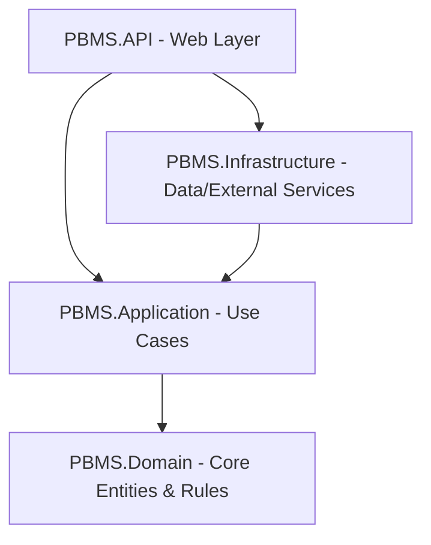

# 🏗️ Kiến Trúc Hệ Thống (Architecture)

Hệ thống PBMS API được xây dựng dựa trên mô hình **Clean Architecture** (còn gọi là Onion Architecture). Thiết kế này giúp mã nguồn tách biệt rõ ràng giữa logic nghiệp vụ và các chi tiết công nghệ (Database, Web Framework, Third-party Service), tăng khả năng bảo trì, mở rộng và viết unit test.

---

## 1. Biểu đồ luồng phụ thuộc (Dependency Flow)

Luồng phụ thuộc luôn hướng từ lớp ngoài vào lớp trong. Các lớp bên trong không biết gì về các lớp bên ngoài.

---

## 2. Chi tiết các Layer trong Project

### 🛡️ 1. PBMS.Domain
* **Vị trí:** `src/PBMS.Domain/`
* **Trách nhiệm:** Là lớp nhân (core) của ứng dụng, chứa các quy tắc nghiệp vụ quan trọng nhất. Lớp này hoàn toàn độc lập và không phụ thuộc vào bất kỳ thư viện hay framework bên ngoài nào.
* **Thành phần chính:**
  * **Entities:** Các thực thể đại diện cho cấu trúc CSDL (ví dụ: `Account`, `Building`, `Floor`, `Zone`, `ParkingSlot`, `Vehicle`, `Booking`, `Card`, `Payment`).
  * **BaseEntity:** Thực thể cơ sở chứa các thuộc tính dùng chung như `Id`, `CreatedAt`, `UpdatedAt`, `CreatedBy`, `UpdatedBy`, `IsDeleted`.
  * **Interfaces:** Các interface cốt lõi của domain (như `ISoftDeletable`).

### ⚙️ 2. PBMS.Application
* **Vị trí:** `src/PBMS.Application/`
* **Trách nhiệm:** Chứa các logic nghiệp vụ và luồng xử lý (Use Cases) của hệ thống. Nhận dữ liệu từ lớp ngoài thông qua DTOs, thực hiện nghiệp vụ và lưu trữ dữ liệu thông qua Interfaces.
* **Thành phần chính:**
  * **DTOs (Data Transfer Objects):** Các đối tượng chứa dữ liệu truyền nhận từ client (như `CreateVehicleTypeDto`, `UpdateVehicleTypeDto`).
  * **Services:** Triển khai logic nghiệp vụ (ví dụ: `VehicleTypeService`, `IncidentService`).
  * **Interfaces:** Định nghĩa hợp đồng (contract) cho Repositories và Services mà lớp `Infrastructure` sẽ triển khai (ví dụ: `IVehicleTypeRepository`, `IVehicleTypeService`).
  * **Common Responses:** Các cấu trúc dữ liệu phản hồi chuẩn (`BaseResponse`).

### 🗄️ 3. PBMS.Infrastructure
* **Vị trí:** `src/PBMS.Infrastructure/`
* **Trách nhiệm:** Triển khai các giao tiếp vật lý với hệ thống bên ngoài: Cơ sở dữ liệu, gửi email, tích hợp cổng thanh toán VNPay, kết nối Firebase, v.v.
* **Thành phần chính:**
  * **AppDbContext:** Cấu hình Entity Framework Core kết nối DB PostgreSQL/SQL Server.
  * **Configurations:** Các thiết lập ánh xạ từ Entity sang bảng vật lý trong DB (Fluent API).
  * **Repositories:** Triển khai các phương thức truy xuất DB được định nghĩa ở lớp Application (ví dụ: `VehicleTypeRepository`).
  * **Migrations:** Các file migration ghi lại lịch sử thay đổi cấu trúc Database.
  * **External Service Implementations:** Các class hiện thực kết nối API bên thứ ba.

### 🔌 4. PBMS.API
* **Vị trí:** `src/PBMS.API/`
* **Trách nhiệm:** Điểm vào (Entry Point) của ứng dụng. Nhận các HTTP Requests, định tuyến (Routing), kiểm tra quyền truy cập (Authentication/Authorization) và phản hồi HTTP Responses về Client.
* **Thành phần chính:**
  * **Controllers:** Định nghĩa các RESTful Endpoints (như `VehicleTypeController`, `AuthController`).
  * **Middlewares:** Xử lý lỗi tập trung (`ExceptionHandlingMiddleware`), ghi log, v.v.
  * **Program.cs:** Điểm bắt đầu của ứng dụng, nơi cấu hình Dependency Injection, Middleware pipeline, Swagger, JWT Auth, Database Provider.

---

## 3. Nguyên tắc Dependency Injection (DI)

Dự án áp dụng cơ chế Dependency Injection (DI) của ASP.NET Core để cấu hình lỏng lẻo (loose coupling) các lớp dịch vụ:
* Các service đăng ký lifetime (Transient, Scoped, Singleton) trong các class `DependencyInjection.cs` của từng layer.
* Lớp `PBMS.API/Program.cs` sẽ gọi các phương thức đăng ký này để kích hoạt toàn bộ hệ thống.
