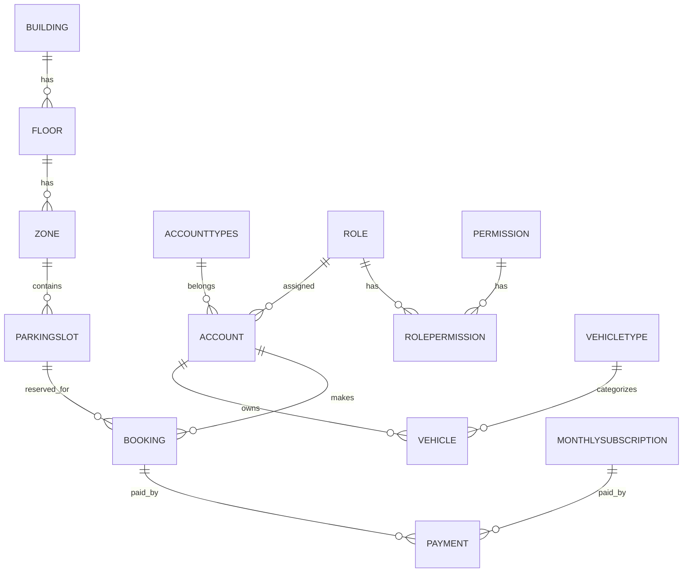

# 🗄️ Thiết Thiết Kế Cơ Sở Dữ Liệu (Database Design)

Hệ thống PBMS sử dụng cơ sở dữ liệu quan hệ **PostgreSQL** cho cả môi trường phát triển và vận hành thực tế. Việc tương tác với CSDL được thực hiện thông qua **Entity Framework Core** theo phương pháp **Code-First**.

---

## 1. Các Thực Thể Chính (Core Entities)

Dưới đây là danh sách các thực thể nghiệp vụ được định nghĩa trong lớp [PBMS.Domain/Entities](file:///D:/FPT/SWP391/parking-system-api/src/PBMS.Domain/Entities):

### Nhóm 1: Quản trị & Xác thực (Identity & Access Management)
* **Account:** Thông tin người dùng hệ thống (tên đăng nhập, email, mật khẩu băm, trạng thái, vai trò).
* **Role:** Đại diện cho các vai trò trong hệ thống (như Admin, Manager, Staff, Customer).
* **Permission:** Định nghĩa các quyền cụ thể đối với tài nguyên hệ thống.
* **RolePermission:** Bảng liên kết trung gian thiết lập mối quan hệ nhiều-nhiều giữa Role và Permission.
* **AuditLog:** Nhật ký ghi nhận các hành vi thay đổi dữ liệu quan trọng của hệ thống (phục vụ giám sát bảo mật).

### Nhóm 2: Cấu trúc bãi xe (Parking Structure)
* **Building:** Thông tin tòa nhà sở hữu bãi đỗ xe.
* **Floor:** Các tầng của tòa nhà bãi xe.
* **Zone:** Các phân khu vực cụ thể trên mỗi tầng (ví dụ: Khu A dành cho xe máy, Khu B dành cho ô tô).
* **ParkingSlot:** Vị trí đỗ xe chi tiết trong mỗi phân khu, chứa tọa độ, trạng thái hoạt động (Trống, Đã đặt, Bảo trì).

### Nhóm 3: Phương tiện & Thẻ xe (Vehicles & Cards)
* **VehicleType:** Các phân loại phương tiện (Xe Máy, Ô Tó, Xe Tải,...).
* **Vehicle:** Thông tin cụ thể của xe gửi (Biển số xe, Màu xe, Hiệu xe, loại xe).
* **Card:** Thẻ gửi xe vật lý (chứa mã thẻ RFID, loại thẻ - Thẻ tháng hoặc Thẻ lượt, trạng thái thẻ).

### Nhóm 4: Giao dịch & Đỗ xe (Transactions & Operations)
* **Booking:** Đơn đặt chỗ đỗ xe trước của khách hàng (chứa thời gian đặt, thời gian kết thúc dự kiến, trạng thái đơn hàng).
* **ParkingSession:** Phiên đỗ xe thực tế ghi nhận thời gian xe vào bãi, xe ra khỏi bãi, thẻ xe được sử dụng và vị trí đỗ.
* **MonthlySubscription:** Đăng ký thẻ tháng của khách hàng thường xuyên (chứa ngày bắt đầu, ngày hết hạn, giá tiền, trạng thái kích hoạt).
* **Payment:** Các giao dịch thanh toán liên quan đến Booking hoặc MonthlySubscription (mã giao dịch, số tiền, phương thức thanh toán, trạng thái thanh toán).

### Nhóm 5: Chính sách giá & Doanh thu (Pricing & Revenue)
* **PricingPolicy:** Các chính sách tính giá vé đỗ xe (áp dụng cho từng loại xe, khung giờ).
* **PricingWindow:** Các khoảng thời gian cụ thể trong ngày áp dụng các mức giá khác nhau (ví dụ: giá ngày, giá đêm).
* **RevenueStatistic:** Thống kê doanh thu định kỳ theo ngày/tháng/năm.
* **RevenueStatisticPayment:** Bảng liên kết chi tiết thống kê hóa đơn đóng góp vào doanh thu.

### Nhóm 6: Sự cố & Danh sách đen (Incidents & Restrictions)
* **IncidentType:** Phân loại sự cố (Ví dụ: Mất thẻ, Xe va chạm, Thiết bị hỏng).
* **Incident:** Chi tiết sự cố được ghi nhận (thời gian, hình ảnh minh chứng, mô tả sự cố, tài khoản xử lý).
* **Blacklist:** Danh sách đen các phương tiện hoặc khách hàng vi phạm quy định gửi xe.

---

## 2. Quan Hệ Giữa Các Bảng (Relationships)



---

## 3. Quản Lý Migration (EF Core Migrations)

Các thay đổi cấu trúc dữ liệu được quản lý bằng EF Core Migrations tại thư mục [PBMS.Infrastructure/Migrations](file:///D:/FPT\SWP391\parking-system-api\src\PBMS.Infrastructure\Migrations). 

*Các thông tin cấu hình chuỗi kết nối và môi trường xem chi tiết tại [CẤU HÌNH HỆ THỐNG](CONFIGURATION.md).*

### Lệnh Tạo Migration Mới:
Khi bạn thay đổi code tại lớp Domain Entities, hãy tạo một migration mới:
```bash
dotnet ef migrations add <TênMigration> --project src/PBMS.Infrastructure --startup-project src/PBMS.API
```

### Lệnh Áp Dụng Migration Vào DB:
```bash
dotnet ef database update --project src/PBMS.Infrastructure --startup-project src/PBMS.API
```

### Lệnh Hủy Bỏ Migration Cuối Cùng (Chưa Apply vào DB):
```bash
dotnet ef migrations remove --project src/PBMS.Infrastructure --startup-project src/PBMS.API
```

---

## 4. Dữ Liệu Hạt Giống Mặc Định (Seed Data)

Hệ thống được cấu hình tự động seed một số dữ liệu cơ sở khi ứng dụng khởi chạy lần đầu:
* **Vehicle Types:**
  * ID 1: `Xe Máy` (Motorcycle)
  * ID 2: `Ô Tó` (Car)
* **System Roles:**
  * Admin, Manager, Staff, Customer.
