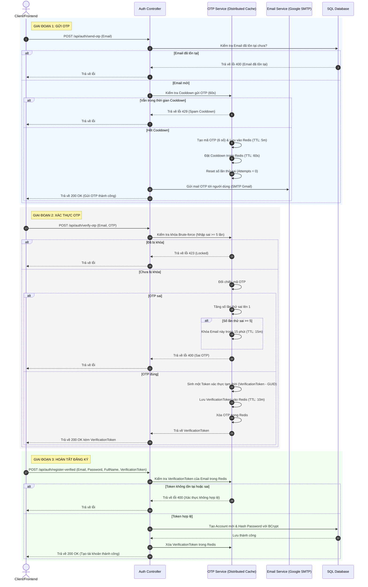

# Hướng dẫn Thiết kế & Triển khai Gửi Email OTP và Xác thực tài khoản với Redis Cache (.NET 10)

Tài liệu này hướng dẫn chi tiết cách thiết lập hệ thống gửi OTP qua email của Google (SMTP) và xác minh mã OTP bằng Redis Cache với cơ chế bảo mật chống Spam (Rate Limiting) và chống Brute-force (Lockout).

---

## 🏗️ 1. Kiến trúc luồng đăng ký (Luồng B)

Quy trình đăng ký tài khoản gồm 3 giai đoạn:



---

## 💾 2. Thiết kế Cấu trúc Key trong Redis Cache

Sử dụng kiểu dữ liệu String của Redis để lưu trữ:

| Chức năng | Định dạng Key | Kiểu dữ liệu | TTL (Thời gian sống) | Mô tả |
| :--- | :--- | :--- | :--- | :--- |
| **Lưu trữ OTP** | `otp:{email}` | String | `5 phút` | Chứa mã OTP hiện tại (ví dụ: `128945`). |
| **Thời gian chờ** | `otp_cooldown:{email}` | String | `60 giây` | Đánh dấu thời điểm gửi OTP gần nhất để chống spam gửi liên tục. |
| **Số lần thử sai** | `otp_attempts:{email}` | String (Integer) | `5 phút` | Đếm số lần nhập sai mã OTP của user. |
| **Khóa tài khoản** | `otp_lockout:{email}` | String | `15 phút` | Đánh dấu email bị khóa thử lại khi nhập sai quá 5 lần. |
| **Token xác thực** | `otp_verified:{email}` | String | `10 phút` | Chứa mã Token (GUID) dùng để gọi API đăng ký sau khi xác thực OTP thành công. |

---

## 🛠️ 3. Các bước triển khai chi tiết

### Bước 1: Thêm gói NuGet cho Redis Cache
Chúng ta sẽ cài đặt thư viện Redis phân tán cho dự án `PBMS.Infrastructure`:
```bash
dotnet add src/PBMS.Infrastructure/PBMS.Infrastructure.csproj package Microsoft.Extensions.Caching.StackExchangeRedis
```

### Bước 2: Cấu hình biến môi trường (`appsettings.json`)
Thêm cấu hình kết nối Redis và SMTP của Google Gmail vào file `appsettings.json`:
```json
{
  "ConnectionStrings": {
    "DefaultConnection": "...",
    "Redis": "localhost:6379"
  },
  "Smtp": {
    "Host": "smtp.gmail.com",
    "Port": 587,
    "EnableSsl": true,
    "Username": "your-gmail@gmail.com",
    "Password": "your-app-password-from-google",
    "DisplayName": "PBMS Support Team"
  }
}
```

> [!NOTE]
> Mật khẩu của Google SMTP không phải mật khẩu tài khoản Gmail thông thường, mà là **Mật khẩu ứng dụng (App Password)** được sinh ra trong trang cài đặt Bảo mật của Tài khoản Google (yêu cầu bật Xác thực 2 bước).

---

### Bước 3: Định nghĩa các Giao diện (Interfaces) ở tầng Application

Tạo các file interface trong thư mục `src/PBMS.Application/Auth/Interfaces/`:

#### 📄 `IEmailService.cs`
```csharp
namespace PBMS.Application.Auth.Interfaces
{
    public interface IEmailService
    {
        Task SendEmailAsync(string toEmail, string subject, string body);
    }
}
```

#### 📄 `IOtpService.cs`
```csharp
namespace PBMS.Application.Auth.Interfaces
{
    public interface IOtpService
    {
        Task<bool> CanSendOtpAsync(string email);
        Task<string> GenerateAndStoreOtpAsync(string email);
        Task<bool> IsLockedOutAsync(string email);
        Task<(bool IsSuccess, string? Message, string? VerificationToken)> VerifyOtpAsync(string email, string otp);
        Task<bool> ValidateVerificationTokenAsync(string email, string token);
        Task ClearVerificationTokenAsync(string email);
    }
}
```

---

### Bước 4: Tạo các DTO (Data Transfer Objects) ở tầng Application

Tạo thư mục hoặc các file DTO trong `src/PBMS.Application/Auth/DTOs/`:

#### 📄 `OtpDtos.cs`
```csharp
using System.ComponentModel.DataAnnotations;

namespace PBMS.Application.Auth.DTOs
{
    public class SendOtpRequest
    {
        [Required]
        [EmailAddress]
        public string Email { get; set; } = null!;
    }

    public class VerifyOtpRequest
    {
        [Required]
        [EmailAddress]
        public string Email { get; set; } = null!;

        [Required]
        [StringLength(6, MinimumLength = 6)]
        public string Otp { get; set; } = null!;
    }

    public class RegisterVerifiedRequest
    {
        [Required]
        [EmailAddress]
        public string Email { get; set; } = null!;

        [Required]
        [MinLength(6)]
        public string Password { get; set; } = null!;

        [Required]
        public string FullName { get; set; } = null!;

        public string? Phone { get; set; }

        [Required]
        public string VerificationToken { get; set; } = null!;
    }
}
```

---

### Bước 5: Triển khai các dịch vụ ở tầng Infrastructure

Tạo các class trong thư mục `src/PBMS.Infrastructure/ExternalServices/`:

#### 📄 `EmailService.cs` (Sử dụng thư viện System.Net.Mail mặc định để gửi mail)
```csharp
using Microsoft.Extensions.Configuration;
using PBMS.Application.Auth.Interfaces;
using System.Net;
using System.Net.Mail;

namespace PBMS.Infrastructure.ExternalServices
{
    public class EmailService : IEmailService
    {
        private readonly IConfiguration _configuration;

        public EmailService(IConfiguration configuration)
        {
            _configuration = configuration;
        }

        public async Task SendEmailAsync(string toEmail, string subject, string body)
        {
            var host = _configuration["Smtp:Host"] ?? "smtp.gmail.com";
            var port = int.Parse(_configuration["Smtp:Port"] ?? "587");
            var enableSsl = bool.Parse(_configuration["Smtp:EnableSsl"] ?? "true");
            var username = _configuration["Smtp:Username"] ?? throw new InvalidOperationException("SMTP Username is not configured.");
            var password = _configuration["Smtp:Password"] ?? throw new InvalidOperationException("SMTP Password is not configured.");
            var displayName = _configuration["Smtp:DisplayName"] ?? "PBMS Team";

            using (var message = new MailMessage())
            {
                message.From = new MailAddress(username, displayName);
                message.To.Add(new MailAddress(toEmail));
                message.Subject = subject;
                message.Body = body;
                message.IsBodyHtml = true;

                using (var client = new SmtpClient(host, port))
                {
                    client.Credentials = new NetworkCredential(username, password);
                    client.EnableSsl = enableSsl;
                    await client.SendMailAsync(message);
                }
            }
        }
    }
}
```

#### 📄 `OtpService.cs` (Triển khai bằng IDistributedCache của Microsoft)
```csharp
using Microsoft.Extensions.Caching.Distributed;
using PBMS.Application.Auth.Interfaces;
using System.Security.Cryptography;

namespace PBMS.Infrastructure.ExternalServices
{
    public class OtpService : IOtpService
    {
        private readonly IDistributedCache _cache;
        private const int MaxFailedAttempts = 5;

        public OtpService(IDistributedCache cache)
        {
            _cache = cache;
        }

        public async Task<bool> CanSendOtpAsync(string email)
        {
            // Kiểm tra xem có đang nằm trong thời gian cooldown 60 giây không
            var cooldown = await _cache.GetStringAsync($"otp_cooldown:{email}");
            return string.IsNullOrEmpty(cooldown);
        }

        public async Task<string> GenerateAndStoreOtpAsync(string email)
        {
            // 1. Sinh OTP 6 số bảo mật
            var otp = RandomNumberGenerator.GetInt32(100000, 999999).ToString();

            // 2. Lưu OTP vào Redis với thời hạn 5 phút
            await _cache.SetStringAsync(
                $"otp:{email}", 
                otp, 
                new DistributedCacheEntryOptions { AbsoluteExpirationRelativeToNow = TimeSpan.FromMinutes(5) }
            );

            // 3. Đặt thời gian cooldown 60 giây chống spam gửi mail liên tục
            await _cache.SetStringAsync(
                $"otp_cooldown:{email}", 
                "active", 
                new DistributedCacheEntryOptions { AbsoluteExpirationRelativeToNow = TimeSpan.FromSeconds(60) }
            );

            // 4. Reset số lần nhập sai về 0
            await _cache.SetStringAsync(
                $"otp_attempts:{email}", 
                "0", 
                new DistributedCacheEntryOptions { AbsoluteExpirationRelativeToNow = TimeSpan.FromMinutes(5) }
            );

            return otp;
        }

        public async Task<bool> IsLockedOutAsync(string email)
        {
            // Kiểm tra xem email có đang bị khóa (Lockout) trong 15 phút không
            var isLocked = await _cache.GetStringAsync($"otp_lockout:{email}");
            return !string.IsNullOrEmpty(isLocked);
        }

        public async Task<(bool IsSuccess, string? Message, string? VerificationToken)> VerifyOtpAsync(string email, string otp)
        {
            // 1. Kiểm tra trạng thái khóa thử lại
            if (await IsLockedOutAsync(email))
            {
                return (false, "This email is temporarily locked due to too many failed OTP attempts. Please try again in 15 minutes.", null);
            }

            // 2. Lấy OTP từ Redis
            var storedOtp = await _cache.GetStringAsync($"otp:{email}");
            if (string.IsNullOrEmpty(storedOtp))
            {
                return (false, "OTP has expired or is invalid. Please request a new code.", null);
            }

            // 3. So sánh OTP
            if (storedOtp != otp)
            {
                // Tăng số lần thử sai
                var attemptsStr = await _cache.GetStringAsync($"otp_attempts:{email}") ?? "0";
                int attempts = int.Parse(attemptsStr) + 1;

                if (attempts >= MaxFailedAttempts)
                {
                    // Đạt giới hạn -> Khóa email trong 15 phút
                    await _cache.SetStringAsync(
                        $"otp_lockout:{email}", 
                        "locked", 
                        new DistributedCacheEntryOptions { AbsoluteExpirationRelativeToNow = TimeSpan.FromMinutes(15) }
                    );
                    await _cache.RemoveAsync($"otp:{email}");
                    return (false, "Too many failed attempts. Your email verification has been locked for 15 minutes.", null);
                }

                // Lưu lại số lần nhập sai mới
                await _cache.SetStringAsync(
                    $"otp_attempts:{email}", 
                    attempts.ToString(), 
                    new DistributedCacheEntryOptions { AbsoluteExpirationRelativeToNow = TimeSpan.FromMinutes(5) }
                );

                return (false, $"Invalid OTP. You have {MaxFailedAttempts - attempts} attempts remaining.", null);
            }

            // 4. OTP đúng -> Sinh Verification Token tạm thời (GUID)
            var verificationToken = Guid.NewGuid().ToString("N");
            
            // Lưu token xác thực vào Redis với thời hạn 10 phút
            await _cache.SetStringAsync(
                $"otp_verified:{email}", 
                verificationToken, 
                new DistributedCacheEntryOptions { AbsoluteExpirationRelativeToNow = TimeSpan.FromMinutes(10) }
            );

            // Dọn dẹp OTP và số lần thử sai
            await _cache.RemoveAsync($"otp:{email}");
            await _cache.RemoveAsync($"otp_attempts:{email}");

            return (true, null, verificationToken);
        }

        public async Task<bool> ValidateVerificationTokenAsync(string email, string token)
        {
            var storedToken = await _cache.GetStringAsync($"otp_verified:{email}");
            return !string.IsNullOrEmpty(storedToken) && storedToken == token;
        }

        public async Task ClearVerificationTokenAsync(string email)
        {
            await _cache.RemoveAsync($"otp_verified:{email}");
        }
    }
}
```

---

### Bước 6: Cấu hình Khởi tạo trong Dependency Injection (`DependencyInjection.cs`)

Tại file `src/PBMS.Infrastructure/DependencyInjection.cs`, tiến hành cấu hình `IDistributedCache`:

```csharp
// Đăng ký dịch vụ Email & OTP
services.AddTransient<IEmailService, EmailService>();
services.AddTransient<IOtpService, OtpService>();

// Cấu hình Distributed Cache động (Tự động fallback về Memory Cache nếu không dùng Redis)
var redisConnectionString = configuration.GetConnectionString("Redis");
if (!string.IsNullOrEmpty(redisConnectionString))
{
    // Đăng ký sử dụng Redis Cache thực tế
    services.AddStackExchangeRedisCache(options =>
    {
        options.Configuration = redisConnectionString;
        options.InstanceName = "PBMS_";
    });
    Console.WriteLine("--> Distributed Cache: Configured StackExchangeRedis.");
}
else
{
    // Đăng ký Memory Cache thay thế (dễ dàng phát triển/test mà không cần chạy Redis local)
    services.AddDistributedMemoryCache();
    Console.WriteLine("--> Distributed Cache: Configured In-Memory Fallback.");
}
```

---

### Bước 7: Cập nhật `IAuthService` & `AuthService` ở tầng Application

#### Thêm các phương thức mới vào `IAuthService.cs`:
```csharp
Task SendOtpForRegisterAsync(string email);
Task<string> VerifyOtpForRegisterAsync(string email, string otp);
Task RegisterVerifiedUserAsync(RegisterVerifiedRequest request);
```

#### Triển khai các phương thức trong `AuthService.cs`:
```csharp
// Tiêm IEmailService, IOtpService và IAccountRepository vào constructor
private readonly IOtpService _otpService;
private readonly IEmailService _emailService;

// Cập nhật Constructor...

public async Task SendOtpForRegisterAsync(string email)
{
    // 1. Kiểm tra email đã có tài khoản chưa
    var existingAccount = await _accountRepository.GetByEmailAsync(email);
    if (existingAccount != null)
    {
        throw new InvalidOperationException("Email is already registered in the system.");
    }

    // 2. Kiểm tra cooldown gửi OTP (chống spam)
    if (!await _otpService.CanSendOtpAsync(email))
    {
        throw new InvalidOperationException("Please wait 60 seconds before requesting another verification code.");
    }

    // 3. Kiểm tra xem email có đang bị khóa (Lockout) không
    if (await _otpService.IsLockedOutAsync(email))
    {
        throw new InvalidOperationException("This email is locked due to too many failed OTP attempts. Please try again in 15 minutes.");
    }

    // 4. Tạo và lưu mã OTP vào cache
    var otp = await _otpService.GenerateAndStoreOtpAsync(email);

    // 5. Gửi email với mã OTP cho user
    var subject = "[PBMS] - Mã xác nhận đăng ký tài khoản mới";
    var body = $@"
        <div style='font-family: Arial, sans-serif; padding: 20px; max-width: 600px; border: 1px solid #eee; border-radius: 8px;'>
            <h2 style='color: #0066cc; text-align: center;'>XÁC MINH ĐỊA CHỈ EMAIL</h2>
            <p>Chào bạn,</p>
            <p>Bạn đang đăng ký tài khoản mới trên hệ thống Quản lý Bãi xe PBMS. Để tiếp tục, vui lòng sử dụng mã OTP dưới đây để xác thực địa chỉ email của bạn:</p>
            <div style='background-color: #f5f5f5; padding: 15px; text-align: center; border-radius: 6px; margin: 20px 0;'>
                <span style='font-size: 28px; font-weight: bold; letter-spacing: 5px; color: #333;'>{otp}</span>
            </div>
            <p style='color: #ff3333; font-weight: bold;'>Mã này có hiệu lực trong vòng 5 phút.</p>
            <p>Nếu bạn không thực hiện yêu cầu này, vui lòng bỏ qua email.</p>
            <hr style='border: none; border-top: 1px solid #eee; margin-top: 30px;' />
            <p style='font-size: 12px; color: #888; text-align: center;'>Hệ thống Quản lý Bãi xe thông minh PBMS</p>
        </div>";

    await _emailService.SendEmailAsync(email, subject, body);
}

public async Task<string> VerifyOtpForRegisterAsync(string email, string otp)
{
    var (isSuccess, message, verificationToken) = await _otpService.VerifyOtpAsync(email, otp);
    if (!isSuccess)
    {
        throw new InvalidOperationException(message ?? "OTP verification failed.");
    }

    return verificationToken!;
}

public async Task RegisterVerifiedUserAsync(RegisterVerifiedRequest request)
{
    // 1. Xác thực xem Token đã vượt qua bước OTP thành công chưa
    var isValid = await _otpService.ValidateVerificationTokenAsync(request.Email, request.VerificationToken);
    if (!isValid)
    {
        throw new InvalidOperationException("Email verification token is invalid or has expired. Please verify your email again.");
    }

    // 2. Kiểm tra lại trùng email lần cuối
    var existingAccount = await _accountRepository.GetByEmailAsync(request.Email);
    if (existingAccount != null)
    {
        throw new InvalidOperationException("Email is already registered.");
    }

    // 3. Khởi tạo tài khoản mới (Vai trò mặc định là Driver - RoleId = 3)
    var account = new Account
    {
        Email = request.Email,
        Username = request.Email.Split('@')[0] + "_" + Guid.NewGuid().ToString().Substring(0, 4),
        FullName = request.FullName,
        Phone = request.Phone,
        AccountStatus = "Active",
        RoleId = 3, // Driver
        PasswordHash = BCrypt.Net.BCrypt.HashPassword(request.Password)
    };

    // 4. Lưu tài khoản mới vào cơ sở dữ liệu
    await _accountRepository.AddAsync(account);
    await _accountRepository.SaveChangesAsync();

    // 5. Xóa bỏ Verification Token khỏi cache để tránh tái sử dụng token
    await _otpService.ClearVerificationTokenAsync(request.Email);
}
```

---

### Bước 8: Tạo Endpoints trong `AuthController.cs`

Tạo các Endpoint tương ứng trong `AuthController.cs` để nhận Request từ Client:

```csharp
/// <summary>
/// API gửi mã OTP xác thực đăng ký tài khoản tới Email.
/// Route: POST /api/auth/send-otp
/// </summary>
[HttpPost("send-otp")]
public async Task<ActionResult<BaseResponse<string>>> SendOtp([FromBody] SendOtpRequest request)
{
    try
    {
        await _authService.SendOtpForRegisterAsync(request.Email);
        return Ok(BaseResponse<string>.Ok(null, "OTP code has been sent to your email successfully."));
    }
    catch (InvalidOperationException ex)
    {
        return BadRequest(BaseResponse<string>.Fail("BAD_REQUEST", ex.Message));
    }
}

/// <summary>
/// API xác thực mã OTP được gửi đến Email.
/// Trả về một VerificationToken nếu OTP hợp lệ để tiến hành đăng ký tài khoản.
/// Route: POST /api/auth/verify-otp
/// </summary>
[HttpPost("verify-otp")]
public async Task<ActionResult<BaseResponse<string>>> VerifyOtp([FromBody] VerifyOtpRequest request)
{
    try
    {
        var verificationToken = await _authService.VerifyOtpForRegisterAsync(request.Email, request.Otp);
        return Ok(BaseResponse<string>.Ok(verificationToken, "OTP verified successfully."));
    }
    catch (InvalidOperationException ex)
    {
        return BadRequest(BaseResponse<string>.Fail("BAD_REQUEST", ex.Message));
    }
}

/// <summary>
/// API hoàn tất đăng ký tài khoản sử dụng mã xác thực VerificationToken thu được từ OTP.
/// Route: POST /api/auth/register-verified
/// </summary>
[HttpPost("register-verified")]
public async Task<ActionResult<BaseResponse<string>>> RegisterVerified([FromBody] RegisterVerifiedRequest request)
{
    try
    {
        await _authService.RegisterVerifiedUserAsync(request);
        return Ok(BaseResponse<string>.Ok(null, "Account registered successfully."));
    }
    catch (InvalidOperationException ex)
    {
        return BadRequest(BaseResponse<string>.Fail("BAD_REQUEST", ex.Message));
    }
}
```

---

## 🧪 4. Hướng dẫn thử nghiệm & Kiểm thử (Testing)

### Cách 1: Chạy test locally không cần cài đặt Redis (Sử dụng In-Memory fallback)
Nếu máy bạn chưa bật Redis, chỉ cần:
1. Đảm bảo cấu hình `"Redis": ""` trống hoặc xóa dòng này khỏi `appsettings.json`.
2. Khi đó, hệ thống sẽ tự động bật **DistributedMemoryCache** (In-Memory).
3. Logic hoạt động hoàn toàn giống Redis bao gồm hết hạn TTL, đếm số lần sai, khóa tài khoản nhưng được quản lý trong bộ nhớ của tiến trình server.

### Cách 2: Chạy kiểm thử thực tế với Redis Cache qua Docker
Để kiểm tra tính năng lưu trữ trên Redis thực thụ:
1. Chạy container Redis cục bộ thông qua Docker Terminal:
   ```bash
   docker run --name pbms-redis -p 6379:6379 -d redis
   ```
2. Thêm hoặc cập nhật địa chỉ Redis trong `appsettings.json`:
   ```json
   "ConnectionStrings": {
     "Redis": "localhost:6379"
   }
   ```
3. Khởi động API, bạn sẽ thấy thông tin log: `--> Distributed Cache: Configured StackExchangeRedis.`
4. Để theo dõi dữ liệu thay đổi và thời hạn của các Key trên Redis thực tế, mở Terminal và chạy lệnh giám sát Redis:
   ```bash
   # Vào bên trong container redis
   docker exec -it pbms-redis redis-cli
   
   # Lệnh lấy tất cả danh sách keys đang có
   KEYS *
   
   # Xem thời gian hết hạn còn lại của key (đơn vị: giây)
   TTL otp:example@gmail.com
   
   # Lấy giá trị của mã OTP đang lưu
   GET otp:example@gmail.com
   ```

---

## 📋 5. Kế hoạch xác minh (Verification Tasks)
Sau khi thực hiện viết code, cần thực hiện kiểm tra:
1. **Kiểm tra biên gửi OTP:** Gửi OTP lần đầu thành công -> Tiếp tục gửi lần 2 trong vòng 60 giây -> Phải báo lỗi *Spam Cooldown*.
2. **Kiểm tra nhập OTP sai liên tục:** Nhập sai mã OTP 5 lần -> Email bị đưa vào Lockout trong 15 phút -> Gọi gửi lại hoặc xác minh sẽ lập tức bị chặn.
3. **Kiểm tra dùng sai Token đăng ký:** Gọi endpoint `register-verified` với token không trùng khớp -> Hệ thống báo lỗi và từ chối tạo tài khoản.
