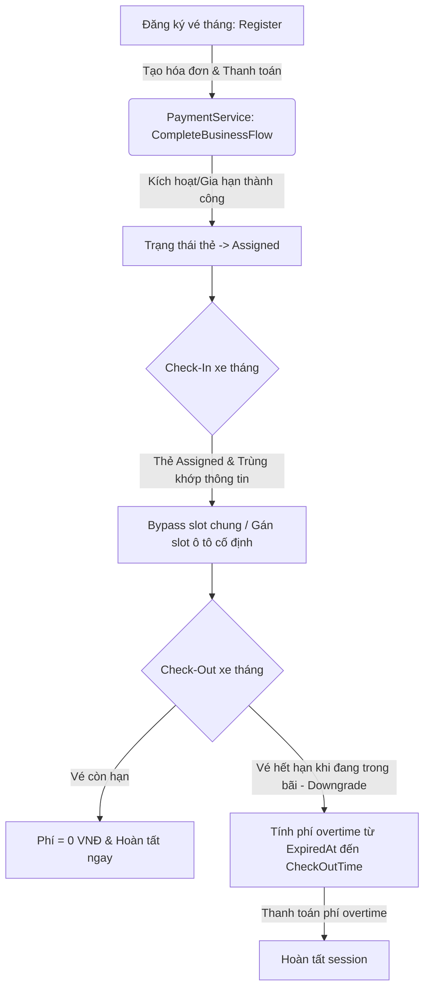

# Tài liệu Nghiệp vụ & Luồng xử lý Vé Tháng (Monthly Subscription)

Tài liệu này mô tả chi tiết các thay đổi trong mã nguồn và luồng chạy thực tế (flow) của từng chức năng có tác động tới **Monthly Subscription** (Đăng ký vé tháng) trong hệ thống PBMS.

---

## 1. Các thay đổi chính trong Cơ sở dữ liệu & Domain

Để hỗ trợ tính năng vé tháng và quản lý trạng thái thẻ gửi xe, các thay đổi sau đã được thực hiện:

*   **`CardStatus` (Enum)**: Bổ sung trạng thái `Assigned` để đánh dấu thẻ đỗ xe đang được gán cố định cho một vé tháng đang hoạt động.
*   **`Card` (Entity)**: Bổ sung thuộc tính `LostAt` (DateTime?) để ghi nhận thời điểm thẻ bị báo mất.
*   **`Zone.AccessType` & `ZoneConfiguration` (EF Core Mapping)**: Cấu hình chuyển đổi enum sang dạng chuỗi (`string`) khi lưu trữ dưới database PostgreSQL, tránh lỗi tự động ánh xạ thành số nguyên (`integer`) làm lỗi migration cơ sở dữ liệu.
*   **`MonthlySubscriptionStatus` (Constants)**: Xác định các trạng thái của vé tháng bao gồm:
    *   `Pending`: Chờ thanh toán kích hoạt.
    *   `Active`: Đang hoạt động (đã thanh toán và còn hạn).
    *   `Cancelled`: Đã bị hủy hoặc tự động dọn dẹp do quá hạn thanh toán kích hoạt.

---

## 2. Luồng chạy chi tiết của các chức năng (Flows)

### Flow 1: Đăng ký Vé Tháng Mới (`RegisterSubscriptionAsync`)
Áp dụng khi khách hàng muốn đăng ký gửi xe theo tháng thông qua cổng đăng ký.

1.  **Kiểm tra tính hợp lệ**: Hệ thống xác thực sự tồn tại của Tài khoản (`AccountId`), Xe (`VehicleId`), và Tòa nhà (`BuildingId`).
2.  **Kiểm tra trùng lặp**: Xác minh phương tiện chưa có bất kỳ vé tháng nào đang ở trạng thái `ACTIVE` hoặc `PENDING`.
3.  **Kiểm tra Thẻ liên kết** (nếu có): Thẻ gửi xe được gán phải thuộc loại thẻ `MONTHLY` và đang ở trạng thái `Available`.
4.  **Xử lý sức chứa & Phân loại xe**:
    *   **Đối với Xe máy**: Kiểm tra sức chứa động của tòa nhà. Số lượng đăng ký xe máy tháng (bao gồm cả `ACTIVE` và `PENDING`) không được vượt quá tổng sức chứa xe máy của tòa nhà đó. Giá vé tháng mặc định: **120.000 VNĐ**.
    *   **Đối với Ô tô**: Hệ thống tự động tìm kiếm một slot đỗ xe còn trống thuộc khu vực vé tháng (`MONTHLY` zone) trong tòa nhà đó để gán cố định (`AssignedSlotId`). Giá vé tháng mặc định: **1.500.000 VNĐ**.
5.  **Lưu trữ**: Tạo bản ghi `MonthlySubscription` với trạng thái mặc định là `Pending` (chờ thanh toán).

---

### Flow 2: Thanh toán & Kích hoạt/Gia hạn (`CompleteBusinessFlowAsync` trong `PaymentService`)
Xảy ra khi người dùng thực hiện thanh toán hóa đơn đăng ký hoặc gia hạn vé tháng (bằng tiền mặt hoặc ngân hàng trực tuyến).

1.  **Xử lý thanh toán thành công**: Khi nhận được xác nhận giao dịch thành công (hoặc IPN callback từ VNPay), hệ thống gọi luồng xử lý sau thanh toán.
2.  **Kích hoạt trạng thái**: Chuyển trạng thái vé tháng thành `Active`.
3.  **Tính toán thời gian hiệu lực (`ActivatedAt` & `ExpiredAt`)**:
    *   **Trường hợp Gia hạn sớm (Vé cũ còn hạn)**: Ngày hết hạn mới sẽ bằng ngày hết hạn cũ cộng thêm 1 tháng (`ExpiredAt = ExpiredAt + 1 Month`). Điều này giúp khách hàng không bị mất những ngày sử dụng còn lại của chu kỳ trước.
    *   **Trường hợp Đăng ký mới hoặc Gia hạn muộn (Đã hết hạn)**: Vé tháng được kích hoạt từ thời điểm hiện tại và có thời hạn dùng 1 tháng (`ExpiredAt = UtcNow + 1 Month`).
4.  **Cập nhật Thẻ**: Thẻ gửi xe liên kết (`AssignedCardId`) tự động chuyển sang trạng thái `Assigned`. Kể từ lúc này, thẻ mới có hiệu lực để quẹt check-in xe tháng.

---

### Flow 3: Check-in Xe Tháng (`CheckInAsync` trong `ParkingSessionService`)
Áp dụng khi xe thẻ tháng quẹt thẻ đi vào bãi đỗ.

1.  **Nhận diện loại thẻ**: Thẻ gửi xe quét vào có trạng thái là `Assigned` (chỉ trạng thái này mới được xem là thẻ tháng hợp lệ).
2.  **Xác thực thông tin**:
    *   Truy vấn thông tin vé tháng đang `Active` được gán cho thẻ đó.
    *   Đối chiếu biển số xe thực tế với biển số đăng ký trên vé tháng.
    *   Đối chiếu loại xe (xe máy/ô tô) và ID tòa nhà.
    *   Kiểm tra thời hạn hiệu lực của vé tháng (`ActivatedAt <= Giờ hiện tại <= ExpiredAt`).
3.  **Bypass kiểm tra Available & Phân bổ chỗ đỗ**:
    *   Hệ thống bỏ qua việc kiểm tra số lượng slot trống chung (General Available slots) vì vé tháng đã được đảm bảo sức chứa từ trước.
    *   **Đối với Ô tô**: Truy xuất chỗ đỗ cố định được gán từ trước (`AssignedSlotId`). Đảm bảo chỗ đỗ này đang trống, sau đó gán slot này vào lượt gửi (`ParkingSession`) và cập nhật trạng thái slot thành `Occupied`.
    *   **Đối với Xe máy**: Tìm khu vực (Zone) phù hợp trong tòa nhà và gán vào lượt gửi.
4.  **Khởi tạo Lượt đỗ**: Tạo bản ghi `ParkingSession` với trạng thái `ACTIVE` và lưu trữ `MonthlySubscriptionId` để dùng cho lúc check-out. **Trạng thái thẻ gửi xe vẫn được giữ nguyên là `Assigned`**.

---

### Flow 4: Check-out Xe Tháng (`StartCheckoutAsync` & Thanh toán Overtime)
Áp dụng khi xe tháng quẹt thẻ đi ra khỏi bãi đỗ.

1.  **Nhận diện lượt đỗ xe tháng**: Hệ thống kiểm tra xem lượt đỗ (`ParkingSession`) hiện tại có gắn `MonthlySubscriptionId` hay không.
2.  **Xử lý dựa trên Thời hạn sử dụng**:
    *   **Trường hợp 1: Vé tháng CÒN HẠN (Check-out Time <= ExpiredAt)**:
        *   Phí đỗ xe cho lượt gửi này bằng **0 VNĐ**.
        *   Hệ thống tự động chuyển trạng thái session thành `COMPLETED` ngay lập tức (không cần qua bước thanh toán).
        *   Giải phóng slot đỗ ô tô cố định (nếu có) về trạng thái `Available`.
        *   **Giữ nguyên trạng thái của thẻ là `Assigned`** để khách hàng tiếp tục sử dụng cho các lần gửi sau.
    *   **Trường hợp 2: Vé tháng HẾT HẠN khi đang trong bãi (Downgrade - Check-out Time > ExpiredAt)**:
        *   Hệ thống **không** hoàn tất session ngay mà giữ trạng thái session là `ACTIVE` (chờ thanh toán).
        *   **Tính phí quá hạn (Overtime fee)**: Phí đỗ xe vãng lai chỉ được tính cho khoảng thời gian từ thời điểm vé tháng hết hạn (`ExpiredAt`) cho tới thời điểm xe check-out (`CheckOutTime`).
        *   Khách hàng thực hiện thanh toán phí overtime này tại cổng checkout (bằng tiền mặt hoặc chuyển khoản trực tuyến qua VNPay).
        *   Sau khi thanh toán thành công, hệ thống gọi `CompleteAsync` để chuyển trạng thái session sang `COMPLETED`, giải phóng slot đỗ ô tô và **giữ nguyên trạng thái thẻ đỗ xe là `Assigned`**.

---

### Flow 5: Hủy đăng ký & Tự động dọn dẹp
Các nghiệp vụ hậu kỳ để thu hồi tài nguyên (thẻ gửi xe, slot đỗ ô tô).

1.  **Hủy đăng ký chủ động (`CancelSubscriptionAsync`)**:
    *   Chuyển trạng thái vé tháng thành `Cancelled`.
    *   Thu hồi thẻ gửi xe: Tìm thẻ được liên kết và đổi trạng thái từ `Assigned` về `Available` để có thể gán cho khách hàng khác.
2.  **Tự động dọn dẹp vé tháng chờ thanh toán quá hạn (`CleanupExpiredPendingSubscriptionsAsync`)**:
    *   Chạy định kỳ để quét các đăng ký vé tháng ở trạng thái `Pending` quá hạn thanh toán quy định (ví dụ: quá 15 phút từ lúc tạo).
    *   Chuyển các đăng ký này sang trạng thái `Cancelled`.
    *   Giải phóng thẻ gửi xe liên kết về `Available`.
    *   *Lưu ý*: Đối với ô tô, slot đỗ cố định được gán sẽ được giải phóng ngay khi đăng ký bị hủy.
